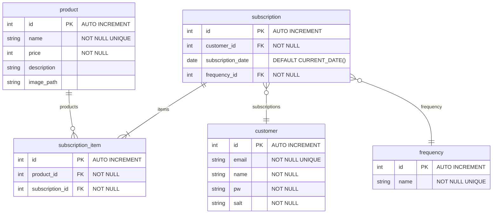

```mermaid
erDiagram
    customer {
        int id PK "AUTO INCREMENT"
        string email "NOT NULL UNIQUE"
        string name "NOT NULL"
        string pw "NOT NULL"
        string salt "NOT NULL"
    }
    
    product {
        int id PK "AUTO INCREMENT"
        string name "NOT NULL UNIQUE"
        int price "NOT NULL"
        string description
        string image_path
    }
    
    frequency {
        int id PK "AUTO INCREMENT"
        string name "NOT NULL UNIQUE"
    }
    
    subscription {
        int id PK "AUTO INCREMENT"
        int customer_id FK "NOT NULL"
        date subscription_date "DEFAULT CURRENT_DATE()"
        int frequency_id FK "NOT NULL"
    }
    
    subscription }O--|| frequency: frequency
    subscription }O--|| customer: subscriptions
    subscription ||--|{ subscription_item: items
    product ||--o{ subscription_item: products
    
    subscription_item {
        int id PK "AUTO INCREMENT"
        int product_id FK "NOT NULL"
        int subscription_id FK "NOT NULL"
    }

```